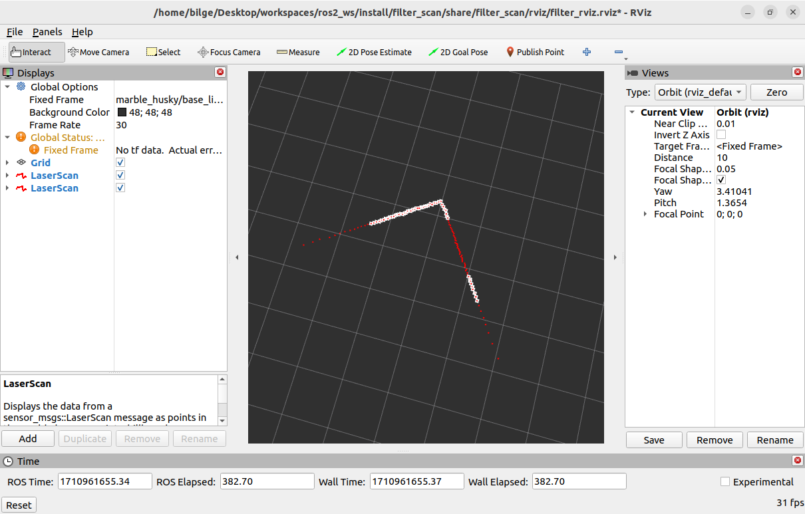
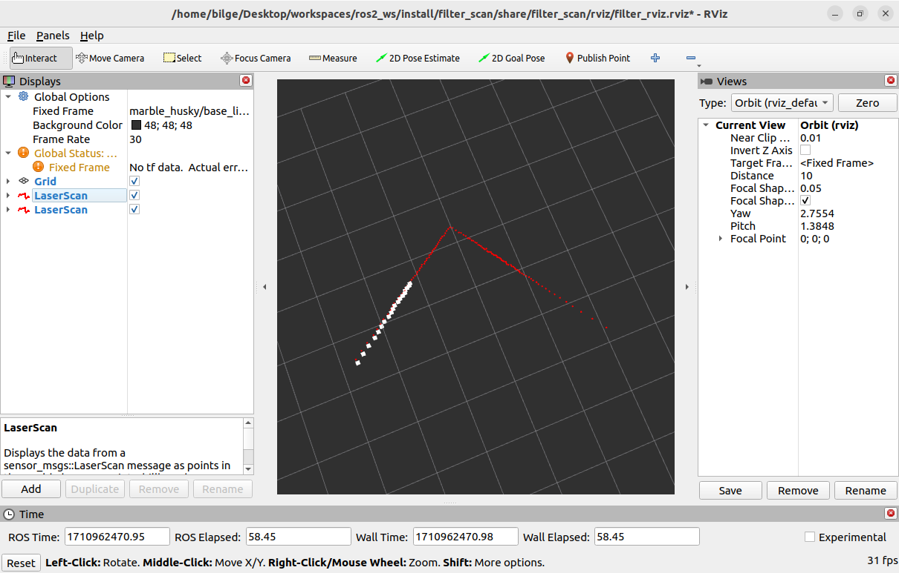

# Filter Lidar

This project contains Python code to filter lidar data based on angle and distance. Proper filtering of lidar data is crucial for various applications such as 3D modeling, mapping, and object detection.

### System Requirements
- OS: Ubuntu 22.04(Jammy Jellyfish)
- ROS2 Humble

### Build Filter Lidar
clone the repository and colcon build ?

```
mkdir -p ~/workspace/src/
cd ~/workspace/src/
git clone git@github.com:bilgeemert/filter_scan.git
cd ..
colcon build
```
### Run Filter Lidar

```
cd ~/workspace/
source install/setup.bash
ros2 launch filter_scan distance_filter.launch.py
```

> distance_filter



> angle_filter



